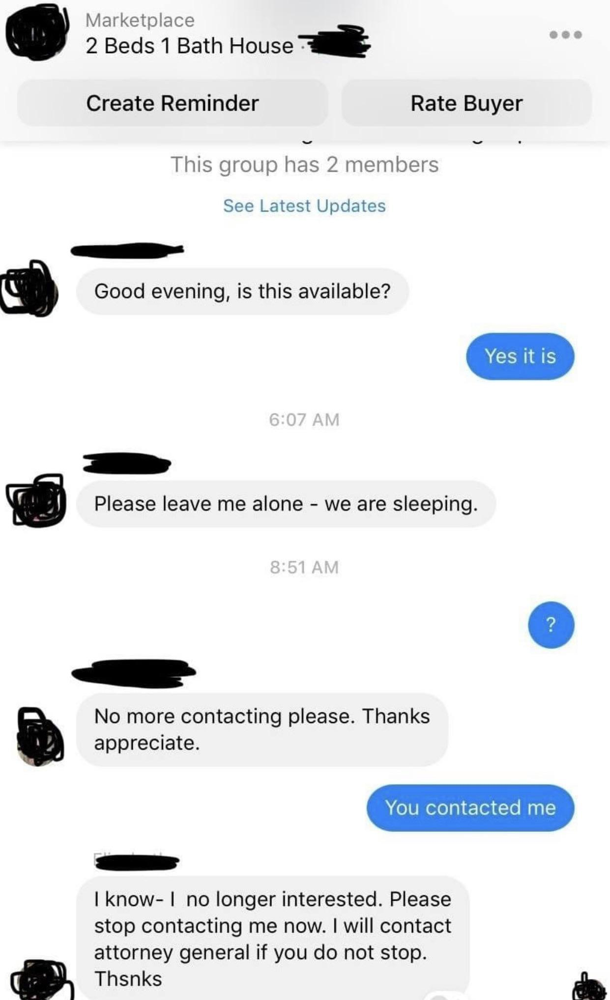
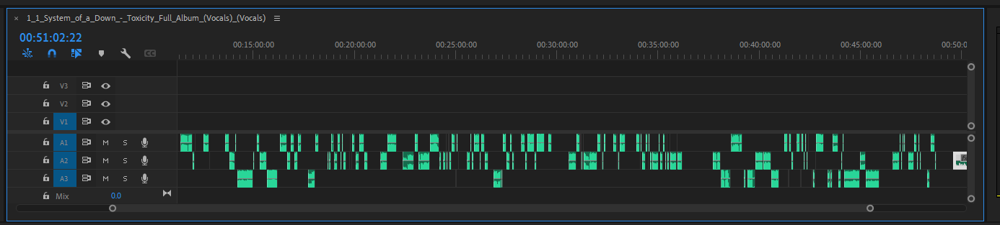
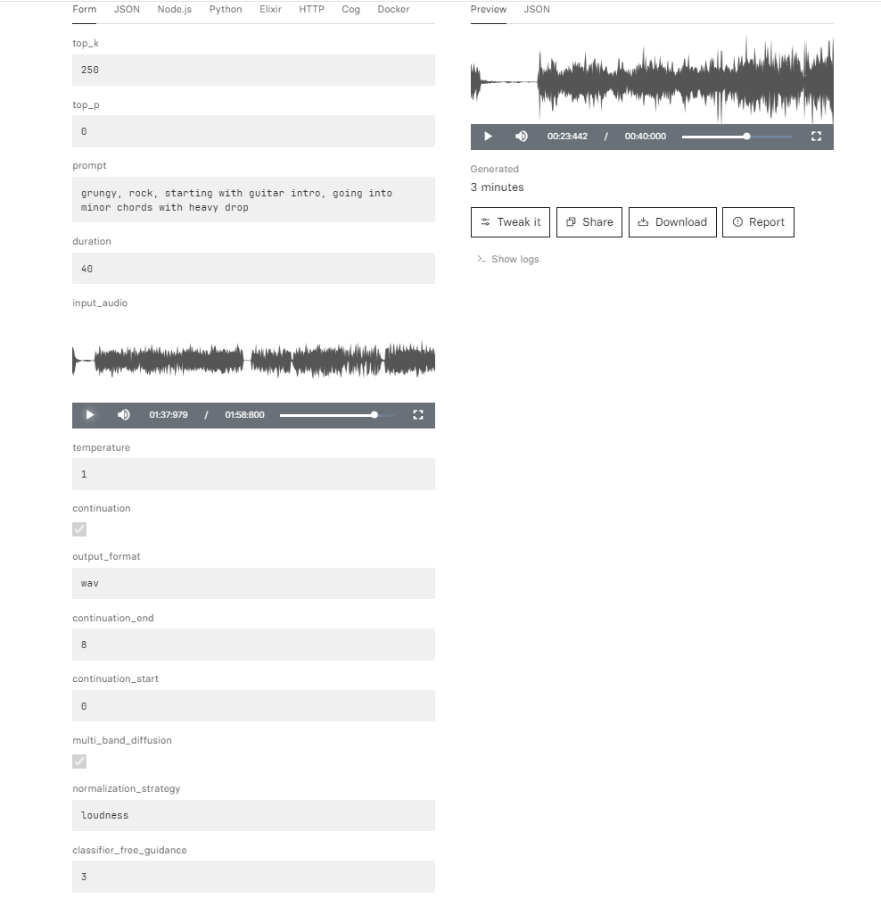

# COMPP FS24 - AI Music Generation from text messages in the style of System of a Down

## Project Overview

The main goal of this project was to generate a song where the lyrics, derived from text conversations, are sung in the distinctive style of System of a Down. This process involved several stages, from exploring existing AI tools and generating songs with lyrics as a prompt to finetuning models to suit the specific music style of the band.

A video by Lubalin called ["Internet Drama - part 1"](https://www.youtube.com/watch?v=OLmun1JEIw0) served as inspiration for the project. I decided to use the same chat messages as the inspired piece for the direct comparison.

  

### 1. Exploring Existing AI Tools

Initially, I researched various AI tools to understand what was available for tasks like text-to-speech (TTS), music generation, and singing synthesis. While TTS and inference tools are widely available as open-source options, high-quality music generation and singing synthesis from text presented significant challenges within the project's timeframe, especially because a crucial part of this project is getting the voice to match the music.

### 2. Generating the Initial Music

To overcome these challenges, I opted to use [Suno](https://suno.com/) for generating music. This tool allowed me to convert text conversations directly into music, ensuring that the vocals matched the speed, harmony, and accentuation of the instrumental. The generated song included both vocals and instrumental parts. However, other than belonging to the Metal genre, they had nothing to do with the iconic sound of System of a Down. In order to achieve this I would have to tweak both the instrumental and the vocals.

### 3. Separating Vocals and Instrumental 

In order to use all the open-source tools I found during my research, I had to split the vocals and instrumental from the generated song and the songs used for training data. I utilized another AI tool called [UVR5](https://github.com/Anjok07/ultimatevocalremovergui/releases/tag/v5.6) to separate the songs into their vocal and instrumental components. This allowed me to create the input and the datasets for the models I finetuned in another step.

### 4. Fine-Tuning AI Models

The band's album Toxicity was used for both the vocal and instrumental training data. The complete album was run through UVR5 to receive both the training data for the music generation AI and the inference voice model:

- **Vocal Model**: The open-source tool [Applio](https://applio.org/) was used to train two different voice Models of Serj Tankian, the lead singer of the band: One for singing and one for screaming. Looking into voice models of many other metal singers during my research I noticed many of them sounded a bit distorted: The sound was sort of ruptured in the harmonics — the high and low frequencies that accompany the main tone. I figured the issue came from training the model on the very different vocal qualities of both screaming and singing present in many metal songs, so I decided to separate them for my project. 50 min of music was extracted into two mp3 files of 16min lengths each to use as training data for the different models. The two fine-tuned models work fine for TTS, however excel at inference. I was especially surprised at the quality of screaming the trained model produced with inference.

  

- **Instrumental Model**: While looking around for fine-tuneable music generation AIs I initially wanted to finetune a Riffusion model, this turned out to be a complete failure: after trying to set up a notebook from scratch I spent multiple days trying to find the correct versions of Python and Tensor packs before having to admit that I would not have the time to research all the different things I needed and acquire enough knowledge on AI training to actually understand what I would need to do for it to work. Luckily I found a [MusicGen Finetuner](https://replicate.com/sakemin/musicgen-fine-tuner) on replicate. This find allowed me to fine-tune a music continuation model on System of a Down so I could use the music track split from the Suno prompt as input and receive a track with matching bpm and harmony.
- [Link to my own fine-tuned SOAD model on replicate](https://replicate.com/tabstle/soad_music_gen/examples) - [Open in Colab](https://colab.research.google.com/drive/1lWqp8TiV969vTRCxl-4jLEjVcQw3TTmh#scrollTo=l2sNBQg-pywR)

  

### 5. Reconstructing the Final Song

The only thing left to do now was to put the different parts back together with [Reaper](https://www.reaper.fm/), a music editing software. The instrumental track was placed on one track and for the vocals I generated the vocal track with both models and then stitched together the screaming parts and singing parts from the correct outputs.

## Results
The generated music tracks can be found in the `Results/` directory.

## Conclusion
## Project Structure
- **Doku/**: Contains documentation
  - **Screenshots/**: Contains Screenshots used in README.
  - **Visuals/**: Contains Other Visual documentation.
    - **Inspiration/**: Inspiration video by Lubalin. 
- **Finetuning/**: Contains files from the different finetuned models.
  - **Applio_Output/**: Generated inference files.
  - **MusicGen_Output/**: Contains music continuation file.
- **Results/**: Final project output.
- **Suno/**: Initially generated songs.

## Steps

### Data Preparation
1. **Vocal and Instrumental Separation**: Used UVR5 Ultimate Vocal Remover AI to separate the vocals and instrumental tracks from the Toxicity album.
2. **Dataset Creation**: Created two vocal datasets (screaming and singing) and one instrumental dataset.

### Model Training
1. **Fine-tune Riffusion**: Attempted to fine-tune Riffusion for both lyrics and instrumental but faced issues.
2. **Train Voice Models**: Used the Applio AI application to train two voice models for screaming and singing.
3. **Fine-tune MusicGen**: Fine-tuned MusicGen by Meta for generating instrumental music.

### Music Generation
1. **Generate Base Track**: Generated a base track using Suno.
2. **Generate Vocals**: Used voice track from Suno to generate vocals with the fine-tuned Applio voice models.
3. **Combine Tracks**: Edited the generated vocals and instrumental together in Reaper to match the beat.

## Acknowledgements
- **UVR5 Ultimate Vocal Remover AI**
- **Applio AI**
- **MusicGen by Meta**
- **Suno**
- **Reaper**
